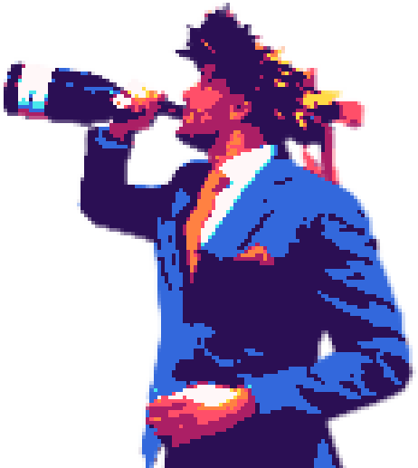

# Graduation Gionni Jump 🎓🚀
A version of Doodle Jump modified for Gionni's Graduation created in Javascript.
Github Pages link: https://giog97.github.io/Graduation-Gionni-Jump/

---

Benvenuti in **Graduation Gionni Jump**, un gioco sviluppato in JavaScript che riprende le meccaniche di Doodle Jump per celebrare in modo divertente la mia laurea. Gioca e aiutami a raggiungere nuove vette nel giorno della mia laurea!

## Caratteristiche principali ✨

- **Gameplay coinvolgente**: salta di piattaforma in piattaforma cercando di raggiungere il punteggio più alto.
- **Grafica personalizzata**: elementi grafici unici creati per l'occasione.
- **Compatibilità**: giocabile su qualsiasi browser moderno senza necessità di installazione.

## Come giocare 🎮

1. **Avvia il gioco**: visita la pagina del gioco su GitHub Pages.
2. **Controlli**: usa le frecce sinistra e destra della tastiera per muovere il personaggio oppure il touch del telefono.
3. **Obiettivo**: salta sulle piattaforme senza cadere e accumula CFU man mano che sali per arrivare ai 300CFU richiesti per una laurea Magistrale!

## Licenza 📄

Questo progetto è distribuito sotto la licenza MIT.

## Ringraziamenti 🙌

Un sentito grazie a tutti coloro che mi hanno supportato durante il percorso universitario. Grazie per aver giocato e festeggiato con me questa importante tappa!

